# BotanikAI

**BotanikAI** is a professional plant-based treatment recommendation app using LLMs.

## Architecture

```mermaid
flowchart TD
  UserQuery["🧑‍🌾 Question utilisateur"] --> Embedder["🔤 Embedding via Mistral"]
  Embedder --> Retriever["📂 Recherche dans CSV / base enrichie"]
  Retriever --> Context["📄 Contexte pertinent"]
  Context --> PromptTemplate["🧩 Template de prompt"]
  PromptTemplate --> LLM["🤖 Mistral (LLM)"]
  LLM --> Response["✅ Réponse générée"]
```

## Structure

botanikai/
├── logo.svg
├── backend/
│   ├── app.py
│   ├── langchain_chains.py
│   ├── requirements.txt
│   └── .github/
│       └── workflows/
│           └── hf_deploy.yml
├── frontend/
│   ├── package.json
│   ├── src/
│   │   ├── App.jsx
│   │   ├── api.js
│   │   ├── components/
│   │   │   ├── SearchForm.jsx
│   │   │   └── Recommendation.jsx
│   │   └── index.js
│   └── vercel.json
├── README.md
└── LICENSE

## Features
- **Plant-based treatment recommendations**: Get personalized treatment plans based on your symptoms.
- **LLM-powered**: Utilizes advanced language models for accurate and relevant recommendations.
- **Image search**: Find images of plants and treatments using Unsplash API.